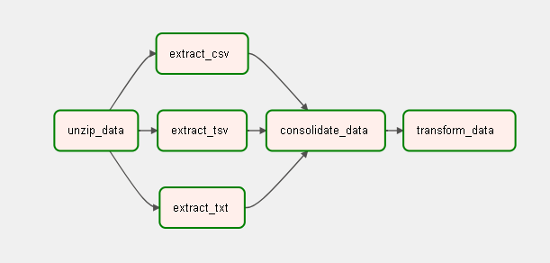

# Build a workflow using Apache Airflow

## Scenario
You are a data engineer at a data analytics consulting company. You have been assigned to a project that aims to de-congest the national highways by analyzing the road traffic data from different toll plazas. Each highway is operated by a different toll operator with different IT setup that use different file formats.  In the first Hands-on lab your job is to collect data available in different formats and, consolidate it into a single file.  

As a vehicle passes a toll plaza, the vehicle's data like vehicle_id,vehicle_type,toll_plaza_id and timestamp are streamed to Kafka. In the second Hands-on lab your job is to create a data pipe line that collects the streaming data and loads it into a database.

## Pipeline

### Commands

* test task: airflow tasks test <dag_id> <task_id> YYYY-MM-DD
* run DAG manually: airflow dags trigger <dag_id>
* start airflow server: airflow standalone